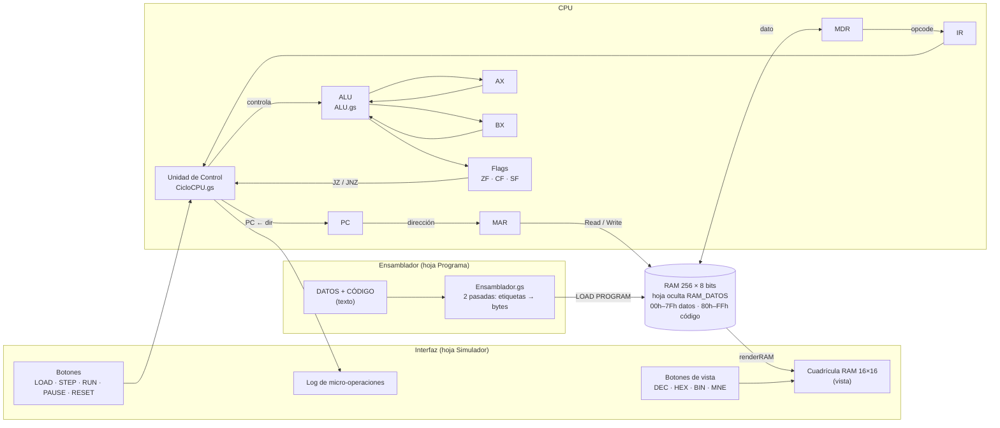

# Simulador de CPU y Memoria Principal (von Neumann, 8 bits)


**Universidad Católica Boliviana "San Pablo" — Sede Santa Cruz**
**Materia:** Arquitectura de Computadoras (SIS131) · **Semestre:** 1/2026 · **Docente:** Ing. Paulo César Loayza Carrasco
**Autor:** Christian (`@ChryzzMT`)


Simulador interactivo y visual de un CPU de 8 bits con su memoria RAM de 256 bytes, construido en **Google Sheets** con lógica en **JavaScript (Google Apps Script)**. Muestra paso a paso el ciclo de instrucción completo **Fetch → Decode → Execute → Store**, resaltando en la hoja el registro, la celda de memoria o la ALU que está activa en cada micro-operación.


> 🔗 **Hoja de cálculo (copia de solo lectura):** `https://docs.google.com/spreadsheets/d/1HFTx2aU8BtH2HWuYjYoLc55v2E0VQBdVjJSAoSKdIVs/edit?usp=sharing`


---


## Tabla de contenidos


1. [Características](#1-características)
2. [Arquitectura](#2-arquitectura)
3. [Mapa de memoria](#3-mapa-de-memoria)
4. [Registros, banderas y ALU](#4-registros-banderas-y-alu)
5. [Ciclo de instrucción](#5-ciclo-de-instrucción)
6. [Conjunto de instrucciones (ISA)](#6-conjunto-de-instrucciones-isa)
7. [Manual de usuario](#7-manual-de-usuario)
8. [Estructura del repositorio](#8-estructura-del-repositorio)
9. [Programas de prueba y traza](#9-programas-de-prueba-y-traza)
10. [Decisiones de diseño y limitaciones](#10-decisiones-de-diseño-y-limitaciones)
11. [Gestión del proyecto](#11-gestión-del-proyecto)
12. [Evolución hacia el Parcial 2](#12-evolución-hacia-el-parcial-2)


---


## 1. Características


- **RAM de 256 bytes** direccionada de `00h` a `FFh`, en una cuadrícula de 16×16, con segmentos de **datos** (`00h–7Fh`, mitad superior) y **código** (`80h–FFh`, mitad inferior, en un tono de azul más oscuro).
- **Cuatro vistas de la RAM:** decimal, hexadecimal, binario y **mnemónico** (el segmento de código se muestra como instrucciones: `MOV`, `ADD`, `JNZ`…), seleccionables con botones.
- **Registros visibles** en tres bases (decimal, hexadecimal y binario): `PC`, `AX`, `BX`, `MAR`, `MDR`, `IR`.
- **Banderas** `ZF`, `CF` y `SF` actualizadas por la ALU.
- **ALU** con `ADD`, `SUB`, `INC`, `DEC`, `AND`, `OR`, `XOR`, `NOT` y `CMP`, dibujada en la hoja con operandos, operación y resultado.
- **Ensamblador propio** que lee el programa desde la hoja `Programa` (con variables, etiquetas y comentarios) y lo traduce a bytes en memoria.
- **Ciclo completo en 4 fases**, cada fase dividida en micro-operaciones con MAR/MDR explícitos.
- **Modos de ejecución:** `STEP` (una fase por clic), `RUN` (continuo con retardo ajustable) y `PAUSE`.
- **Resaltado por colores** de los componentes activos, según la fase.
- **Log cronológico** de micro-operaciones con el estado de los registros en cada paso.
- **Inspector de memoria:** al seleccionar una celda de la RAM se muestra su valor en decimal, hexadecimal y binario, su segmento y, si es el opcode de una instrucción, la instrucción completa desensamblada.


---


## 2. Arquitectura





### Diseño modular


| Módulo (`src/`) | Responsabilidad |
|---|---|
| `Codigo.gs` | Constantes globales: nombre de hojas, posiciones de celdas (RAM, registros, ALU, log), colores por fase, retardo. Avisos (`aviso`, `avisoError`). |
| `ISA.gs` | Tabla de instrucciones (opcode, tamaño, descripción) y utilidades hex/binario. |
| `MemoriaRAM.gs` | Primitivas `readRAM(dir)` y `writeRAM(dir, valor)`, carga de la imagen de 256 bytes, vistas DEC/HEX/BIN/MNE, desensamblador de la RAM e inspector de celda. |
| `CPU_Registros.gs` | Registros, banderas, estado de control del ciclo, persistencia entre clics y `resetCPU()`. |
| `ALU.gs` | `ejecutarALU(op, a, b)`: calcula el resultado, actualiza banderas y anima la unidad en la hoja. |
| `CicloCPU.gs` | Las cuatro fases (`faseFetch`, `faseDecode`, `faseExecute`, `faseStore`) y `avanzarFase()`. |
| `Ensamblador.gs` | Análisis, codificación y ensamblado en dos pasadas; programa demostrativo y `diagnostico()`. |
| `ControladoresUI.gs` | Manejadores de los botones: `btnLoadProgram`, `btnStep`, `btnRun`, `btnPause`, `btnReset`. |


Cada módulo depende solo de las constantes de `Codigo.gs` y de las funciones públicas de los demás, lo que permite ampliar el sistema (bus, E/S, interrupciones) sin reescribir el núcleo.


---


## 3. Mapa de memoria


La RAM se muestra como una matriz de 16 × 16 celdas (filas `00h`–`F0h`, columnas `0`–`F`) en el rango `L8:AA23` de la hoja `Simulador`. La dirección de una celda es `fila × 16 + columna`.


| Rango | Filas | Segmento | Uso |
|---|---|---|---|
| `00h – 7Fh` | `00h – 70h` | **Datos** | Variables declaradas en la columna DATOS, asignadas en orden desde `00h`. |
| `80h – FFh` | `80h – F0h` | **Código** | Instrucciones del programa, desde `80h`. |


- Ancho de palabra: **8 bits** por celda (valores `0–255`).
- Al cargar un programa, el `PC` se inicializa en **`80h`**.
- Primitivas de acceso: `readRAM(dir)` y `writeRAM(dir, valor)`. Ambas validan el rango y lanzan error si la dirección o el valor no caben en 8 bits.
- **Almacenamiento real:** los 256 bytes se guardan como números en una hoja oculta llamada `RAM_DATOS` (se crea sola). La cuadrícula visible de `Simulador` es solo una **vista** que se redibuja según el formato elegido; por eso no se edita a mano y `RAM_DATOS` no debe borrarse.


---


## 4. Registros, banderas y ALU


### Registros (8 bits)


| Registro | Función |
|---|---|
| `PC` | *Program Counter*: dirección de la siguiente instrucción o byte a leer. |
| `IR` | *Instruction Register*: opcode de la instrucción en curso. |
| `MAR` | *Memory Address Register*: dirección de la celda que se lee o escribe. |
| `MDR` | *Memory Data Register*: último dato transferido desde o hacia la RAM. |
| `AX` | Acumulador / propósito general (código `0` en el ensamblador). |
| `BX` | Propósito general (código `1` en el ensamblador). |


### Banderas (1 bit)


| Bandera | Se activa cuando… |
|---|---|
| `ZF` (Zero) | el resultado de la última operación de ALU fue `0`. |
| `CF` (Carry) | `ADD`/`INC`: hubo acarreo (resultado > 255). `SUB`/`CMP`/`DEC`: hubo préstamo (el minuendo es menor que el sustraendo). |
| `SF` (Sign) | el bit 7 del resultado es `1` (negativo en complemento a 2). |


Solo las operaciones de la ALU modifican las banderas; `MOV`, `LOAD`, `STORE` y los saltos las dejan intactas.


### Operaciones de la ALU


| Operación | Cálculo | Actualiza ZF | CF | SF |
|---|---|:-:|:-:|:-:|
| `ADD` | `a + b` | ✔ | ✔ | ✔ |
| `SUB` | `a − b` | ✔ | ✔ | ✔ |
| `CMP` | `a − b` (no guarda resultado) | ✔ | ✔ | ✔ |
| `INC` | `a + 1` | ✔ | ✔ | ✔ |
| `DEC` | `a − 1` | ✔ | ✔ | ✔ |
| `AND` / `OR` / `XOR` | operación bit a bit | ✔ | 0 | ✔ |
| `NOT` | `~a` | ✔ | 0 | ✔ |


Todos los resultados se truncan a 8 bits (`& 0xFF`). En la hoja, la ALU muestra el operando 1 (`C19`), el operando 2 (`E19`), la operación (`D23`) y el resultado (`D25`); las banderas están en `H21` (ZF), `H23` (CF) y `H25` (SF).


---


## 5. Ciclo de instrucción


Cada clic en `STEP` ejecuta **una fase**; cada fase registra en el log las micro-operaciones que la componen. El `Paso #` del log avanza en cada fase.


| Fase | Color | Micro-operaciones |
|---|---|---|
| **1. FETCH** | 🟦 Azul | `MAR ← PC` · `MDR ← M[MAR]` · `IR ← MDR` · `PC ← PC + 1` |
| **2. DECODE** | 🟨 Amarillo | La Unidad de Control identifica el opcode en `IR` y, por cada operando, hace `MAR ← PC` · `MDR ← M[MAR]` · `PC ← PC + 1`. |
| **3. EXECUTE** | 🟩 Verde | La ALU calcula y actualiza banderas; `LOAD` lee la RAM; `STORE` prepara `MAR` y `MDR`; los saltos modifican el `PC`. |
| **4. STORE** | 🟥 Rojo | Escritura del resultado en `AX`/`BX` (write-back) o en memoria (`RAM[MAR] ← MDR`). Si la instrucción fue `HLT`, se detiene el reloj. |


Los saltos condicionales evalúan `ZF` en EXECUTE: `JZ` salta si `ZF = 1` y `JNZ` salta si `ZF = 0`.


---


## 6. Conjunto de instrucciones (ISA)


**Formato:** `[opcode] [operando 1] [operando 2]`, un byte cada uno. Los registros se codifican como `AX = 0`, `BX = 1`. Las direcciones de salto son **absolutas**.


| Mnemónico | Opcode (dec) | Opcode (hex) | Bytes | Codificación | Descripción |
|---|:-:|:-:|:-:|---|---|
| `HLT` | 0 | 00h | 1 | `00` | Detiene el reloj. |
| `MOV reg, imm` | 1 | 01h | 3 | `01 reg imm` | Carga un valor inmediato en un registro. |
| `MOV reg, reg` | 2 | 02h | 3 | `02 dst src` | Copia un registro a otro. |
| `LOAD reg, [dir]` | 3 | 03h | 3 | `03 reg dir` | `reg ← M[dir]` |
| `STORE [dir], reg` | 4 | 04h | 3 | `04 dir reg` | `M[dir] ← reg` |
| `ADD reg, imm` | 5 | 05h | 3 | `05 reg imm` | `reg ← reg + imm` |
| `ADD reg, reg` | 6 | 06h | 3 | `06 dst src` | `dst ← dst + src` |
| `SUB reg, imm` | 7 | 07h | 3 | `07 reg imm` | `reg ← reg − imm` |
| `SUB reg, reg` | 8 | 08h | 3 | `08 dst src` | `dst ← dst − src` |
| `INC reg` | 9 | 09h | 2 | `09 reg` | `reg ← reg + 1` |
| `DEC reg` | 10 | 0Ah | 2 | `0A reg` | `reg ← reg − 1` |
| `AND reg, reg` | 11 | 0Bh | 3 | `0B dst src` | `dst ← dst AND src` |
| `OR reg, reg` | 12 | 0Ch | 3 | `0C dst src` | `dst ← dst OR src` |
| `XOR reg, reg` | 13 | 0Dh | 3 | `0D dst src` | `dst ← dst XOR src` |
| `NOT reg` | 14 | 0Eh | 2 | `0E reg` | `reg ← NOT reg` |
| `CMP reg, imm` | 15 | 0Fh | 3 | `0F reg imm` | Calcula `reg − imm`, solo actualiza banderas. |
| `CMP reg, reg` | 16 | 10h | 3 | `10 r1 r2` | Calcula `r1 − r2`, solo actualiza banderas. |
| `JMP dir` | 17 | 11h | 2 | `11 dir` | `PC ← dir` |
| `JZ dir` | 18 | 12h | 2 | `12 dir` | Si `ZF = 1`, `PC ← dir`. |
| `JNZ dir` | 19 | 13h | 2 | `13 dir` | Si `ZF = 0`, `PC ← dir`. |


### Sintaxis del ensamblador


- **Comentarios:** todo lo que sigue a `;` se ignora.
- **Etiquetas:** `NOMBRE:` al inicio de una línea; se pueden usar como destino de `JMP`, `JZ` y `JNZ`.
- **Variables:** se declaran en la columna DATOS como `NOMBRE = valor` y se asignan en `00h`, `01h`, `02h`… según el orden. En el código se usan entre corchetes: `LOAD AX, [NOMBRE]`.
- **Números:** decimal (`35`), hexadecimal con sufijo (`23h`) o con prefijo (`0x23`), rango `0–255`.
- **Mayúsculas:** etiquetas, variables, mnemónicos y registros no distinguen mayúsculas.
- **Errores:** el ensamblador valida todo antes de tocar la RAM e informa la línea y el motivo (instrucción desconocida, etiqueta duplicada, número fuera de rango, código que excede `FFh`, etc.) en un cuadro de diálogo.


---


## 7. Manual de usuario


### 7.1 Preparación


1. Abre la hoja de Google (o tu copia) y espera a que carguen los scripts.
2. Al ejecutar por primera vez un botón, Google pedirá autorizar el script: acepta los permisos.
3. En la hoja `Simulador`, escribe `Delay (ms)` en `C5` y el retardo deseado en `D5` (por defecto `300`).
4. Pulsa **LOAD PROGRAM** una vez: en el primer uso crea la hoja oculta `RAM_DATOS`.


### 7.2 Escribir un programa


1. Ve a la hoja **`Programa`**.
2. En la columna **DATOS** (`B5` hacia abajo) declara variables, una por celda: `A = 10`.
3. En la columna **CÓDIGO** (`C5` hacia abajo) escribe una instrucción por celda.
4. Mantén los títulos en las filas 1–4 y **no dejes otro texto en las columnas B y C debajo del programa**: el ensamblador lo interpretaría como parte del programa y daría error.


Ejemplo:


| DATOS | CÓDIGO |
|---|---|
| `A = 10` | `LOAD AX, [A]` |
| `B = 20` | `LOAD BX, [B]` |
| `RESULTADO = 0` | `ADD AX, BX` |
| | `STORE [RESULTADO], AX` |
| | `HLT` |


### 7.3 Ejecutar en la hoja `Simulador`


| Botón | Acción |
|---|---|
| **LOAD PROGRAM** | Ensambla la hoja `Programa` (sin modificarla), escribe los 256 bytes en la RAM, pone los registros en cero, fija `PC = 80h` y limpia el log y la ALU. Si hay un error, muestra un cuadro con la línea y el motivo, y la RAM no cambia. |
| **STEP** | Avanza **una fase** del ciclo (FETCH, DECODE, EXECUTE o STORE). El componente activo se ilumina con el color de la fase. |
| **RUN** | Ejecuta de forma continua hasta `HLT`, `PAUSE` o error. La velocidad depende del retardo. |
| **PAUSE** | Detiene `RUN` al terminar la fase en curso. Se puede continuar con `RUN` o `STEP`. |
| **RESET** | Pone en cero registros, `PC`, banderas, **toda la RAM**, log y ALU. El programa sigue en la hoja `Programa`; pulsa `LOAD PROGRAM` para volver a cargarlo con `PC = 80h`. |
| **DEC / HEX / BIN / MNE** | Cambian el formato en que se muestra la RAM (ver 7.4). |
| **DELAY** (celda `D5`) | Retardo en milisegundos de cada resaltado (`0–3000`, por defecto `300`). |


### 7.4 Vistas de la RAM


| Botón | Qué muestra la cuadrícula |
|---|---|
| **DEC** | Cada byte en decimal (`0–255`). Vista por defecto. |
| **HEX** | Cada byte en hexadecimal de dos dígitos (`00`–`FF`). |
| **BIN** | Cada byte en binario de 8 dígitos. Si se corta, ensancha las columnas `L:AA`. |
| **MNE** | El segmento de datos sigue en decimal; en el segmento de código, la celda del opcode muestra el mnemónico (`MOV`, `ADD`, `JNZ`…) y las celdas de operandos muestran `AX`/`BX`, el inmediato en decimal o la dirección en hexadecimal. Los bytes posteriores al último `HLT` se muestran como `0`. |


Cambiar de vista no altera la memoria; solo redibuja la cuadrícula. El resaltado de las fases funciona en cualquier vista. Al seleccionar una celda aparece un aviso con su valor en Dec/Hex/Bin, su segmento y, en el opcode de una instrucción, la instrucción completa (por ejemplo `STORE [01h], AX`).


### 7.5 Leer la interfaz


- **Registros** (`D8:F13`): decimal, hexadecimal y binario de `PC`, `AX`, `BX`, `MAR`, `MDR`, `IR`.
- **ALU:** operando 1, operando 2, operación y resultado de la última operación; a su derecha `ZERO FLAG`, `CARRY FLAG` y `SIGN FLAG`.
- **RAM** (`L8:AA23`): segmento de datos en la mitad superior y de código en la inferior (más oscura), en el formato elegido.
- **Log** (desde la fila 31): paso, fase, detalle de la operación, micro-instrucción y estado de los registros.


### 7.6 Notas de uso


- `RUN` se detiene automáticamente tras unos 5 minutos por el límite de Apps Script; pulsa `RUN` otra vez para continuar.
- El estado del CPU se conserva entre clics, así que se puede alternar `STEP` y `RUN` libremente.
- `RUN` y `STEP` ejecutan lo que ya está en la RAM, no lo que se ve en la hoja `Programa`. Para modificar una instrucción o un dato en vivo: edita la hoja `Programa` y pulsa `LOAD PROGRAM`.
- Sin `LOAD PROGRAM` tras un `RESET`, la CPU lee `00` (`HLT`) en la dirección 0 y se detiene enseguida; es el comportamiento esperado.
- No borres la hoja oculta `RAM_DATOS`: contiene la memoria real.
- Para diagnosticar problemas de ensamblado, ejecuta `diagnostico()` desde el editor de Apps Script: imprime variables, etiquetas y los primeros bytes de datos y código.


---


## 8. Estructura del repositorio


```text
SimuladorCPU/
├── README.md
└── src/
    ├── Codigo.gs            # configuración global y avisos
    ├── ISA.gs               # tabla de instrucciones y utilidades
    ├── MemoriaRAM.gs        # Read / Write, vistas de la RAM e inspector
    ├── CPU_Registros.gs     # registros, flags, estado, reset
    ├── ALU.gs               # unidad aritmético-lógica
    ├── CicloCPU.gs          # Fetch / Decode / Execute / Store
    ├── Ensamblador.gs       # ensamblador de dos pasadas + demo + diagnóstico
    └── ControladoresUI.gs   # botones LOAD / STEP / RUN / PAUSE / RESET
```


---


## 9. Programas de prueba y traza


### 9.1 Programa demostrativo: multiplicación por sumas sucesivas (7 × 5)


Contiene un **bucle** (`JNZ BUCLE`) y una **bifurcación** (`JZ OK`) que verifica el resultado.


**Datos**


| Variable | Dirección | Valor inicial |
|---|:-:|:-:|
| `FACTOR` | `00h` | 5 |
| `RESULTADO` | `01h` | 0 |
| `ESTADO` | `02h` | 0 |


**Código fuente**


```asm
        MOV AX, 0            ; acumulador = 0
        LOAD BX, [FACTOR]    ; contador = 5
BUCLE:  ADD AX, 7            ; AX = AX + 7
        DEC BX               ; contador--
        JNZ BUCLE            ; repetir mientras ZF = 0
        STORE [RESULTADO], AX
        CMP AX, 35           ; verificar 7 * 5
        JZ OK
        MOV BX, 255          ; error
        JMP FIN
OK:     MOV BX, 1            ; correcto
FIN:    STORE [ESTADO], BX
        HLT
```


**Código de máquina (33 bytes, `80h`–`A0h`)**


| Dirección | Instrucción | Bytes |
|:-:|---|---|
| `80h` | `MOV AX, 0` | `01 00 00` |
| `83h` | `LOAD BX, [FACTOR]` | `03 01 00` |
| `86h` | `BUCLE: ADD AX, 7` | `05 00 07` |
| `89h` | `DEC BX` | `0A 01` |
| `8Bh` | `JNZ BUCLE` | `13 86` |
| `8Dh` | `STORE [RESULTADO], AX` | `04 01 00` |
| `90h` | `CMP AX, 35` | `0F 00 23` |
| `93h` | `JZ OK` | `12 9A` |
| `95h` | `MOV BX, 255` | `01 01 FF` |
| `98h` | `JMP FIN` | `11 9D` |
| `9Ah` | `OK: MOV BX, 1` | `01 01 01` |
| `9Dh` | `FIN: STORE [ESTADO], BX` | `04 02 01` |
| `A0h` | `HLT` | `00` |


Etiquetas: `BUCLE = 86h`, `OK = 9Ah`, `FIN = 9Dh`.


#### Traza de registros (por instrucción)


`PC` es el valor **después** de terminar la instrucción (tras FETCH, DECODE y un posible salto). En total se ejecutan **23 instrucciones = 92 fases**.


| # | Dir | Instrucción | PC | AX | BX | ZF | CF | SF | Efecto |
|:-:|:-:|---|:-:|:-:|:-:|:-:|:-:|:-:|---|
| 1 | 80h | `MOV AX, 0` | 83h | 0 | 0 | 0 | 0 | 0 | |
| 2 | 83h | `LOAD BX, [FACTOR]` | 86h | 0 | 5 | 0 | 0 | 0 | `BX ← M[00h]` |
| 3 | 86h | `ADD AX, 7` | 89h | 7 | 5 | 0 | 0 | 0 | |
| 4 | 89h | `DEC BX` | 8Bh | 7 | 4 | 0 | 0 | 0 | |
| 5 | 8Bh | `JNZ BUCLE` | **86h** | 7 | 4 | 0 | 0 | 0 | salta |
| 6 | 86h | `ADD AX, 7` | 89h | 14 | 4 | 0 | 0 | 0 | |
| 7 | 89h | `DEC BX` | 8Bh | 14 | 3 | 0 | 0 | 0 | |
| 8 | 8Bh | `JNZ BUCLE` | **86h** | 14 | 3 | 0 | 0 | 0 | salta |
| 9 | 86h | `ADD AX, 7` | 89h | 21 | 3 | 0 | 0 | 0 | |
| 10 | 89h | `DEC BX` | 8Bh | 21 | 2 | 0 | 0 | 0 | |
| 11 | 8Bh | `JNZ BUCLE` | **86h** | 21 | 2 | 0 | 0 | 0 | salta |
| 12 | 86h | `ADD AX, 7` | 89h | 28 | 2 | 0 | 0 | 0 | |
| 13 | 89h | `DEC BX` | 8Bh | 28 | 1 | 0 | 0 | 0 | |
| 14 | 8Bh | `JNZ BUCLE` | **86h** | 28 | 1 | 0 | 0 | 0 | salta |
| 15 | 86h | `ADD AX, 7` | 89h | 35 | 1 | 0 | 0 | 0 | |
| 16 | 89h | `DEC BX` | 8Bh | 35 | 0 | **1** | 0 | 0 | resultado 0 → `ZF = 1` |
| 17 | 8Bh | `JNZ BUCLE` | 8Dh | 35 | 0 | 1 | 0 | 0 | **no salta**, sale del bucle |
| 18 | 8Dh | `STORE [RESULTADO], AX` | 90h | 35 | 0 | 1 | 0 | 0 | `M[01h] ← 35` |
| 19 | 90h | `CMP AX, 35` | 93h | 35 | 0 | 1 | 0 | 0 | `35 − 35 = 0` → `ZF = 1` |
| 20 | 93h | `JZ OK` | **9Ah** | 35 | 0 | 1 | 0 | 0 | salta |
| 21 | 9Ah | `MOV BX, 1` | 9Dh | 35 | 1 | 1 | 0 | 0 | |
| 22 | 9Dh | `STORE [ESTADO], BX` | A0h | 35 | 1 | 1 | 0 | 0 | `M[02h] ← 1` |
| 23 | A0h | `HLT` | A1h | 35 | 1 | 1 | 0 | 0 | CPU detenida |


**Estado final:** `AX = 35 (23h)`, `BX = 1`, `M[01h] = 35` (resultado), `M[02h] = 1` (verificación correcta), `ZF = 1`, `CF = 0`, `SF = 0`, `PC = A1h`.


#### Traza de micro-operaciones de una instrucción (`ADD AX, 7` en `86h`, primera vuelta)


| Fase | Micro-operación | Registros tras la operación |
|---|---|---|
| FETCH | `MAR ← PC` | MAR = 86h |
| FETCH | `MDR ← M[MAR]` | MDR = 05h (opcode `ADD_IMM`) |
| FETCH | `IR ← MDR` | IR = 05h |
| FETCH | `PC ← PC + 1` | PC = 87h |
| DECODE | La UC decodifica `IR` → `ADD_IMM` (3 bytes) | |
| DECODE | Operando 1: `MAR ← PC; MDR ← M[MAR]; PC++` | MAR = 87h, MDR = 00h (AX), PC = 88h |
| DECODE | Operando 2: `MAR ← PC; MDR ← M[MAR]; PC++` | MAR = 88h, MDR = 07h, PC = 89h |
| EXECUTE | `ALU(ADD): AX + 7` | ALU: `0 + 7 = 7`, ZF = 0, CF = 0, SF = 0 |
| STORE | `AX ← resultado` | AX = 7 |


### 9.2 Programa básico: suma de dos variables (10 + 20)


```asm
; DATOS: A = 10, B = 20, RESULTADO = 0
LOAD AX, [A]
LOAD BX, [B]
ADD AX, BX
STORE [RESULTADO], AX
HLT
```


| # | Dir | Instrucción | AX | BX | Efecto |
|:-:|:-:|---|:-:|:-:|---|
| 1 | 80h | `LOAD AX, [A]` | 10 | 0 | `AX ← M[00h]` |
| 2 | 83h | `LOAD BX, [B]` | 10 | 20 | `BX ← M[01h]` |
| 3 | 86h | `ADD AX, BX` | 30 | 20 | ALU: 10 + 20 = 30, `ZF = 0` |
| 4 | 89h | `STORE [RESULTADO], AX` | 30 | 20 | `M[02h] ← 30` |
| 5 | 8Ch | `HLT` | 30 | 20 | `PC = 8Dh` (141) |


### 9.3 Prueba de banderas y ALU (casos borde)


Verifica `ZF`, `CF` y `SF` con préstamo, acarreo, resultado cero y resultado negativo, además de las operaciones lógicas.


**Datos:** `RES = 0` (dirección `00h`)


```asm
MOV AX, 5
SUB AX, 8            ; 5 - 8 = 253 -> CF=1 (préstamo), SF=1
MOV BX, 3
ADD AX, BX           ; 253 + 3 = 256 -> 0: CF=1 (acarreo), ZF=1
MOV AX, 12
MOV BX, 10
AND AX, BX           ; 12 AND 10 = 8
OR AX, BX            ; 8 OR 10 = 10
XOR AX, BX           ; 10 XOR 10 = 0 -> ZF=1
NOT AX               ; NOT 0 = 255 -> SF=1
STORE [RES], AX
HLT
```


| # | Dir | Instrucción | AX | BX | ZF | CF | SF | Observación |
|:-:|:-:|---|:-:|:-:|:-:|:-:|:-:|---|
| 1 | 80h | `MOV AX, 5` | 5 | 0 | 0 | 0 | 0 | |
| 2 | 83h | `SUB AX, 8` | 253 | 0 | 0 | **1** | **1** | préstamo; MSB = 1 |
| 3 | 86h | `MOV BX, 3` | 253 | 3 | 0 | 1 | 1 | `MOV` no toca banderas |
| 4 | 89h | `ADD AX, BX` | 0 | 3 | **1** | **1** | 0 | acarreo; resultado 0 |
| 5 | 8Ch | `MOV AX, 12` | 12 | 3 | 1 | 1 | 0 | |
| 6 | 8Fh | `MOV BX, 10` | 12 | 10 | 1 | 1 | 0 | |
| 7 | 92h | `AND AX, BX` | 8 | 10 | 0 | 0 | 0 | lógicas ponen `CF = 0` |
| 8 | 95h | `OR AX, BX` | 10 | 10 | 0 | 0 | 0 | |
| 9 | 98h | `XOR AX, BX` | 0 | 10 | **1** | 0 | 0 | |
| 10 | 9Bh | `NOT AX` | 255 | 10 | 0 | 0 | **1** | |
| 11 | 9Dh | `STORE [RES], AX` | 255 | 10 | 0 | 0 | 1 | `M[00h] ← 255` |
| 12 | A0h | `HLT` | 255 | 10 | 0 | 0 | 1 | `PC = A1h` |


---


## 10. Decisiones de diseño y limitaciones


**Decisiones**


- **Operandos leídos en DECODE.** El FETCH trae solo el opcode; los operandos (1 o 2 bytes) se leen durante DECODE con el mismo mecanismo `MAR ← PC → MDR ← M[MAR] → PC++`. Así cada instrucción puede ocupar 1, 2 o 3 bytes.
- **Una fase por paso.** `STEP` avanza una fase completa, con todas sus micro-operaciones anotadas en el log, y el color resalta lo que se toca en esa fase.
- **CF como préstamo en la resta.** En `SUB`, `CMP` y `DEC`, `CF = 1` indica que el minuendo era menor que el sustraendo (convención de x86). `INC` y `DEC` también actualizan `CF`, a diferencia de x86 real.
- **Estado persistente.** Apps Script no conserva variables entre ejecuciones, así que registros, banderas y control del ciclo se guardan como propiedades del script al final de cada fase (`guardarEstadoCPU` / `cargarEstadoCPU`).
- **RAM separada de su vista.** Los valores reales viven en la hoja oculta `RAM_DATOS`; la cuadrícula de `Simulador` se redibuja (`renderRAM`) según el formato elegido. Esto permite mostrar hexadecimal, binario y mnemónicos sin perder los números que la CPU necesita leer.
- **PAUSE cooperativo.** `PAUSE` activa una bandera persistente que `RUN` consulta antes de cada fase.
- **Validación previa.** El ensamblador construye la imagen completa de 256 bytes en memoria y solo la escribe si todo el programa es válido; tras escribirla, la lee de vuelta para verificarla.


**Limitaciones conocidas**


- `RUN` está limitado por el tiempo máximo de ejecución de Apps Script (se corta a los 5 minutos; se reanuda con `RUN`).
- La cuadrícula de RAM no es editable a mano: los cambios se hacen desde la hoja `Programa` y `LOAD PROGRAM`.
- Las operaciones lógicas `AND`, `OR` y `XOR` solo admiten operandos de tipo registro.
- Los registros son solo `AX` y `BX`.
- No hay instrucciones de pila, subrutinas, saltos con signo ni E/S; estas quedan para el Parcial 2.


---


## 11. Gestión del proyecto


- **Repositorio:** `https://github.com/ChryzzMT/SimuladorCPU`
- **Tablero Kanban (GitHub Projects):** `https://github.com/users/ChryzzMT/projects/3/views/1`
---


## 12. Evolución hacia el Parcial 2


La arquitectura está pensada para crecer sin reescribir el núcleo:


- **Bus del sistema:** `readRAM` / `writeRAM` son el único punto de acceso a memoria, por lo que se pueden reemplazar por transacciones de bus (dirección, datos, control).
- **Entrada/Salida:** la ISA se puede extender con nuevos opcodes (`IN`, `OUT`) y un espacio de direcciones para controladores de E/S.
- **Interrupciones:** la Unidad de Control (`avanzarFase`) puede consultar una línea de interrupción entre instrucciones antes de iniciar un nuevo FETCH.
- **Más registros:** `REGISTROS_ASM` y `leerReg` / `escribirReg` centralizan el acceso a registros de propósito general.


---


*Proyecto académico — SIS131 Arquitectura de Computadoras, UCB "San Pablo" Santa Cruz.*


